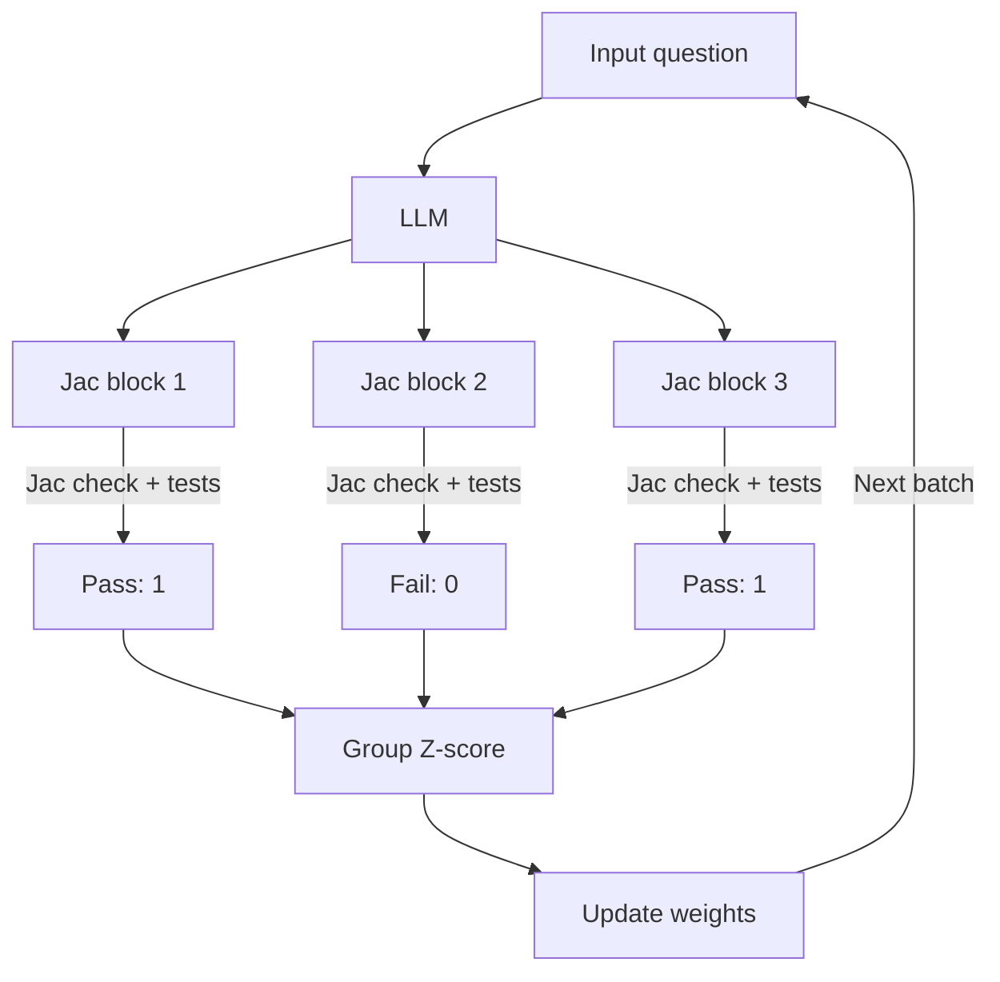

# Reinforcement Learning

> **Purpose:** Increase the chance that JacCoder solves verifiable Jac tasks through trial and error. Start from an SFT model that can already solve some tasks; if every answer to a problem fails, GRPO has no relative signal to learn from.

## Spike

Do not build a large dataset yet. First define the task format, write a few problems, check that grading works, and run a small training update.

Use our own grading suite for RL. The vendored [Nitin-test](../script/eval/Nitin-test/USER_MANUAL.md) remains an external benchmark; do not train on its private test set or change its output format.

### Problem format

```text
dataset/rl/
  <task_name>/<set_name>/
    tasks/<id>/
      request.md          # Problem statement and public examples
      meta.json           # Harness-only ID, target filename, and output format
      starter.jac         # Single-function starting code
      files/              # Optional starting project files
    tests/<id>/            # Grader-only; never copied into the model workspace
    splits/
      train.txt
      dev.txt
      test.txt

script/rl/graders/
  <task_name>.py           # Shared grading logic, not duplicated per problem
```

`tasks/<id>/` is the source task folder, not the model's workspace. The harness shows only `request.md`, `starter.jac`, and needed `files/` to the model; it reads `meta.json` itself. Hidden tests and grading-only data stay under `tests/<id>/`. `splits/` identifies training, development, and final-evaluation tasks.

For a single-file task, the harness combines `request.md` and `starter.jac` into the model input and asks for one fenced `jac` block. [`extract_jac_blocks()`](../script/utils/jac_block.py) extracts it; `meta.json` supplies the destination filename. The grader receives the resulting folder of `.jac` files, not the raw model response.

## Design of the experiment

### Backend

Example `request.md`:

```md
# Add two integers

Implement `add(a: int, b: int) -> int` so it returns their sum.
Example: `add(2, 3) == 5`.
```

Example `starter.jac`:

```jac
def add(a: int, b: int) -> int {
    return 0;
}
```

- **Model:** Receives the request and starter, plus a common instruction to return the complete file in exactly one fenced `jac` block.
- **Harness:** Renders the prompt from `request.md` and `starter.jac`, samples completions, uses `extract_jac_blocks()` to require one block, and writes it to the target path from harness-only `meta.json`.
- **Grader:** Runs `jac check` and hidden tests. Initial reward: `0` if compilation fails; otherwise `tests_passed / tests_total`.
- **Spike:** Measure compile rate, test pass rate, reward variation within groups, and grading time.

### Multifile

- **Model:** Receives a change request and starting project; produces updated files.
- **Harness:** Stages `files/`, applies the model's changes, and passes the resulting project to the grader.
- **Grader:** Compiles, checks cross-file references, and runs tests.

### Tool use

- **Model:** Receives a request and file tools; edits the repository over multiple turns.
- **Harness:** Runs the tool loop, records the rollout, and submits the final workspace for grading.
- **Grader:** Checks whether the requested change works. Rollouts must come from the policy being trained; an external agent's score alone is not enough for on-policy GRPO.

### Fullstack

- **Model:** Receives a user request and initialized Jac app; produces the app.
- **Harness:** Creates the starting project and runs build/browser checks on the result.
- **Grader:** Scores reproducible behavior first; visual quality later.

## Method

### GRPO



- **Rollout:** One question produces multiple independent Jac completions from the current policy. Three are shown for clarity; the proposed group size is eight. Generation needs no gradients.
- **Grade:** Materialize each block and run the same Jac checks and tests. `1, 0, 1` is a simple pass/fail example; the Backend reward can also be a fraction of tests passed.
- **Group Z-score:** Normalize rewards within this question's group: `advantage = (reward - group_mean) / group_std`. If all rewards are equal, this group has no relative learning signal.
- **Update:** Use those advantages to compute the GRPO loss, backpropagate, and update the weights. The next batch is generated by the updated policy.

### GSPO

Use the same completion-level reward as GRPO. The difference is the importance-sampling ratio used during the update: token-level for GRPO, sequence-level for GSPO. Test whether sequence-level updates help the MoE model instead of assuming they will. With this repo's pinned `trl==0.24.0`, compare `importance_sampling_level="token"` and `"sequence"` while keeping the other settings fixed. See the [TRL 0.24 documentation](https://huggingface.co/docs/trl/v0.24.0/grpo_trainer).

## Suggested parameters to test

- Temperature: `0.8`
- Group size: `8`
- Attempt: `16`? Clarify whether this means evaluation pass@16 or training group size.

These are starting points, not tuned values. Ornith's serving suggestions for general tasks (`temperature=0.6`, `top_p=0.95`, `top_k=20`) are inference settings and need not be optimal for RL training.
