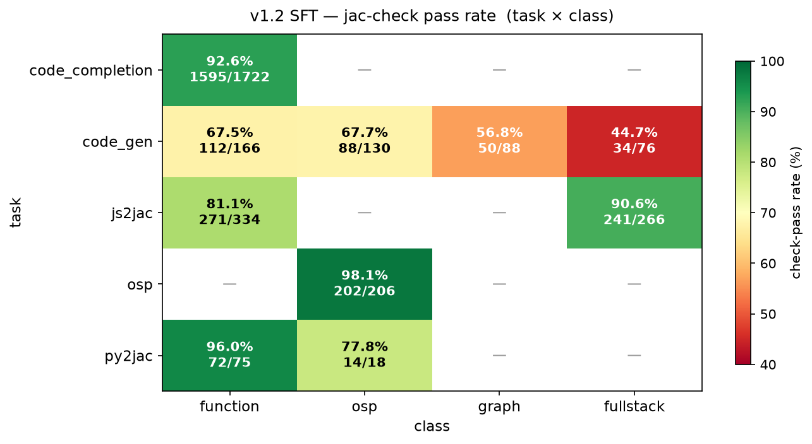
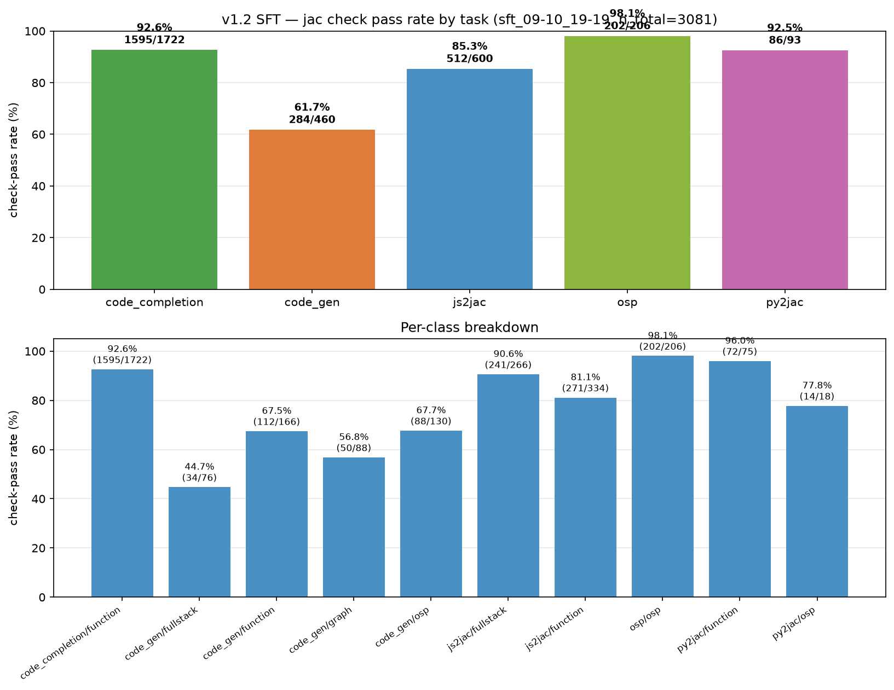

# v1.2 SFT — `jac check` pass-rate report

Run tag: **`sft_09-10_19-19`** (adapter `0910-*` on eval sets under
`output/eval/eval/…`, HDD).
Gate: `jac check` only (no `jac run`). "check pass" = model output has a Jac
block AND `jac check` succeeds on the extracted code.

## Overall

| Task | Dataset | n | has_block | no_output | check_pass | rate |
|---|---|---:|---:|---:|---:|---:|
| code_completion | Nitin-9k-py2jac-idiom | 1722 | 1706 | 16 | 1595 | **92.6%** |
| code_gen        | opus-synth-v2         |  460 |  445 | 15 |  284 | **61.7%** |
| js2jac          | Nitin-3k-js2jac-idiom |  600 |  597 |  3 |  512 | **85.3%** |
| osp             | Nitin-1k-osp          |  206 |  205 |  1 |  202 | **98.1%** |
| py2jac          | opus-synth-v2         |   93 |   93 |  0 |   86 | **92.5%** |
| **overall**     | —                     | **3081** | **3046** | **35** | **2679** | **87.0%** |

## Per-class breakdown (task × class)

| task \\ class | function | osp | graph | fullstack |
|---|---:|---:|---:|---:|
| code_completion | **92.6%** (1595/1722) | — | — | — |
| code_gen        | 67.5% (112/166)       | 67.7% (88/130) | 56.8% (50/88) | **44.7%** (34/76) |
| js2jac          | 81.1% (271/334)       | — | — | 90.6% (241/266) |
| osp             | —                     | **98.1%** (202/206) | — | — |
| py2jac          | **96.0%** (72/75)     | 77.8% (14/18) | — | — |

## Charts

## Observations

- **Strong tasks (>90%):** `osp` generation, `py2jac`, and `code_completion`
  — the model produces syntactically valid Jac reliably on these.
- **Weak task:** `code_gen / fullstack` at 44.7% is the outlier. Sample
  inspection shows leftover `cl { ... }` placement markers (removed in the
  Jac version this eval targeted) and stale placement syntax.
- **js2jac** split: fullstack (90.6%) outperforms function (81.1%) — likely
  because fullstack answers stay closer to the pattern seen in training,
  while function-shaped answers hit more Jac-specific syntax edges.
- **code_gen / function** at 67.5% is well below `code_completion / function`
  at 92.6% — same task shape, so the delta is roughly "generate from scratch
  vs. finish a prefix." That gap (~25pp) is what a strong SFT should close.

## Caveats

- This is a **syntax-only** signal — `jac check` succeeds ≠ tests pass.
  Compare with `sft_test_09-13_17-28` on Nitin-test (which does run hidden
  tests) where AC pass@1 = 49.8% but compile rate = 81.1%.
- Reports live on HDD: `/run/media/imrui/Seagate/Jaseci/JacLLM/JacCoder/output/eval/eval/<task>/<ds>/sft_09-10_19-19/`.
- No `jac run` ladder was enabled in this run.
