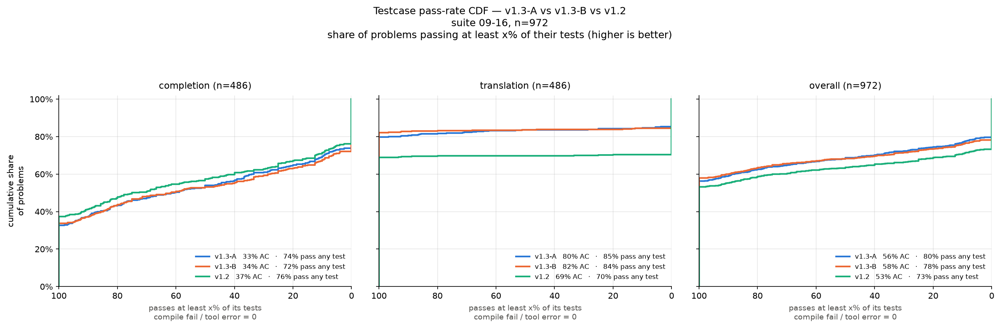
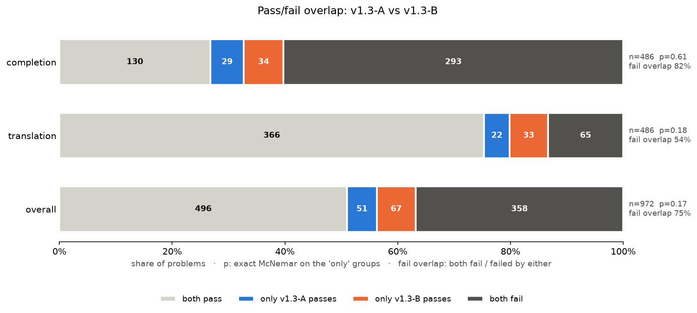

# v1.3 - Updated Dataset
> ablation: include compile-only OSP in CPT or not

Base `ornith-ai/Ornith-1.5-9B`, CPT → SFT, LoRA r64 on all layers. Trained 2026-09-27.

## 1. Datasets

**CPT** (sequential, in this order). Tokens use the Ornith tokenizer. ">4k" counts documents truncated at `max_seq_length` 4096.

| # | dataset (`dataset/cpt/…`) | docs | tokens | >4k | A | B |
|---|---|---:|---:|---:|:-:|:-:|
| 1 | Ayush-JacDocs-26Sept | 253 | 0.71M | 42 | ✓ | ✓ |
| 2 | Nitin-composer-fn | 14,220 | 1.93M | 0 | ✓ | ✓ |
| 3 | Nitin-js2jac | 2,620 | 0.83M | 1 | ✓ | ✓ |
| 4 | Nitin-farm | 1,558 | 1.05M | 1 | ✓ | ✓ |
| 5 | Nitin-jachacks | 1,776 | 3.17M | 179 | ✓ | ✓ |
| 6 | **Nitin-osp-compile-only** | 5,157 | 9.88M | 26 | | ✓ |
| 7 | Nitin-osp | 2,454 | 2.79M | 7 | ✓ | ✓ |
| 8 | Rui-jacapp-4 | 119 | 0.33M | 9 | ✓ | ✓ |
| | **total** | | | | **23,000 docs, 10.8M tok** | **28,157 docs, 20.7M tok** |

**SFT** (sequential, identical for A and B; the `train` split, plus `valid` where one exists)

| # | task / dataset (`dataset/sft/…`) | rows | tokens |
|---|---|---:|---:|
| 1 | code_completion / Nitin-composer-fn | 11,478 | 2.64M |
| 2 | js2jac / Nitin-js2jac | 2,627 | 1.92M |
| 3 | farm / Nitin-farm | 1,557 | 1.13M |
| 4 | osp / Nitin-osp-merged | 1,933 | 2.15M |
| 5 | py2osp / Nitin-osp-lift-gold | 325 | 0.57M |
| 6 | code_fix / Nitin-osp-repair | 795 | 1.71M |
| 7 | test_gen / Nitin-osp-repair | 1,436 | 2.75M |
| 8 | scaffold2impl / Rui-jacapp-scaffold | 433 | 0.92M |
| | **total** | **20,584** | **13.8M** |

## 2. A vs B

The only difference is CPT dataset #6, **Nitin-osp-compile-only**: 5,157 OSP programs
that pass `jac check` but were never run against tests.

- **A**: CPT without it. 2,300 steps, 2 h 10 m.
- **B**: CPT with it, placed between jachacks and osp. 2,816 steps, 3 h 49 m.

Everything else is identical: SFT mix, hyperparameters, seed. Recipes:
`script/train/recipe/0926-v13-compile-only-ablation/`.

## 3. Results

Nitin function test suite: `jac-data-gen` `ed403a56`, 972 problems (486 completion,
486 py→jac translation), jac 0.36.1. Pass means every hidden test passes.

| | pass@1 | completion | translation | compiles |
|---|---:|---:|---:|---:|
| v1.2 (baseline) | 53.2% | **37.4%** | 68.9% | 81.3% |
| **A** | 56.3% | 32.7% | 79.8% | 87.6% |
| **B** | **57.9%** | 33.7% | **82.1%** | 86.0% |

- Both arms beat v1.2 on translation, mainly because fewer answers fail to compile
  (133 → 65 / 72).
- Both arms are **worse than v1.2 on completion**, at every threshold. That comes from
  the rest of the v1.3 recipe, not from compile-only (see §4).

## 4. Comparison: A vs B

**On paper B leads by 1.6 pp, and the gap is not significant** (exact McNemar p = 0.17).
Under the headline, 118 problems flip: 51 pass only with A, 67 only with B.

What the flipped problems look like (all 118 with diffs: `ab_flips.jsonl`):

| | A passes, B fails | B passes, A fails |
|---|---:|---:|
| problems | 51 (29 completion / 22 translation) | 67 (34 / 33) |
| loser fails to compile | 26 | 23 |
| loser fails tests | 25 (6 pass ≥80% of tests) | 44 (10 pass ≥80%) |
| answers differ by 1 line | 16 | 23 |
| v1.2 passes the same problem | 73% | 57% |

Findings:

1. **Most flips are borderline problems, not skill differences.** The two answers are
   close (median similarity 0.8), and a third differ by a single line. v1.2 passes
   only 57–73% of these problems, compared with 81% of the ones both arms pass. Typical
   one-line flips:
   - redundant parentheses around a returned tuple (compile error);
   - `60.` vs `60.0` (compile error);
   - `-> list[str]` vs `-> list[bytes]` (type error);
   - `len(lines) - 1` vs `len(lines)`;
   - `<< 8` vs `<< 16`;
   - `p25[0]` vs `p25[1]`.
2. **No direction by task.** Each side wins about half its flips on completion and half
   on translation.
3. **One small signal: B skips type annotations more often.** When B fails to compile,
   7 of its 26 errors are `E0052 parameter missing a type annotation`. When A fails to
   compile, 2 of 23 are. The rest are scattered syntax and type errors in both
   directions.
4. **A keeps more of v1.2's easy wins.** v1.2 passes 73% of A's wins vs 57% of B's,
   so some of B's losses are problems the older model already solved.

**Conclusion:** compile-only data doesn't change function-level skill. The A/B gap is the
size of single-token sampling differences. This suite has no OSP problems, so what
compile-only is meant to teach still needs an OSP eval.

## Notes

- **Completion regression lead:** during SFT, loss on the completion segment
  (steps 0–1,150) stays flat at ~0.25 while other tasks drop to ~0.05
  ([loss chart](image/loss_sft.png)). Completion is also trained first and never
  revisited.
- **No packing on Ornith** (hybrid linear attention). Documents over 4k tokens are
  truncated (the >4k column), and this hits both arms except dataset #6.
- **Not comparable** to numbers on the old 1,000-problem suite, including the Ornith-35B
  / Qwen3-Coder-30B report, which is graded with jaclang 0.16.1.
- SFT-A was interrupted at step 1,949 and resumed from `checkpoint-1900`.
- More charts: [CPT loss](image/loss_cpt.png),
  per-run buckets [A](image/passrate_dist_A.png) / [B](image/passrate_dist_B.png).
  Eval outputs are in `script/eval/Nitin-test/out/v13{A,B}_test_*`.
