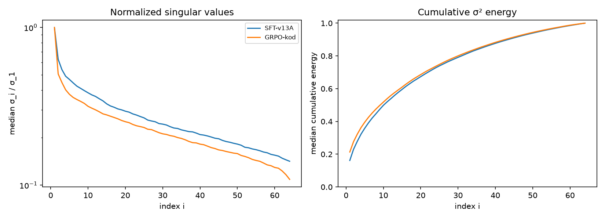

# GRPO on KodCode (kodcode-1k train_180): Results

October 7, 2026

**Goal:** train a fresh r64 LoRA with GRPO on the 180 KodCode tasks with the most learning signal, starting from SFTv1.3 merged into bf16, within an 8 h budget. Then check whether it beats SFTv1.3 on held-out tasks and compare its singular-value decay with the SFT adapter.

**Result:** no measurable change on held-out dev or on the 180 trained tasks. The run underfitted: the RL update is about 0.5% of the SFT update. The run took about 15 h, not 8 h.

---

## 1. Setup

| | |
|---|---|
| Start model | SFTv1.3 (`0926-v13-A`) merged into bf16 (`output/model/JacLLM-SFT-Ornith-9B-v1.3A-bf16`), loaded in 4-bit |
| Adapter | fresh LoRA, r64, alpha 32, rsLoRA, all linear layers: step 0 = SFTv1.3, the adapter holds only the RL update |
| Data | `kodcode-1k` `train_180`: top 15 tasks per subset by reward std in the SFTv1.3 pre-screen ([kod-result.md](kod-result.md)), from `train_active` (1–7 of 8 full passes), no prompt-length filter |
| Steps | 1 epoch = 180 tasks / 2 tasks per step = 90 steps; checkpoints at 30, 60, 90 |
| Per step | 2 tasks × 8 completions = 16 completions |
| Optimizer | lr 5e-6, **linear decay to 0**, warmup 5, adamw_8bit |
| GRPO | loss `dapo`, token-level IS, beta 0, epsilon 0.2, scale_rewards group, temperature 0.8, truncated completions masked |
| Lengths | prompt ≤ 1024, **completion ≤ 768** |
| Reward | `jac check` then hidden tests, reward = passed / total |
| Time | 00:54 → 13:39 training (12.7 h), then 3 dev evals, ALL_DONE 15:08 on 10-06 (RTX 5080) |

Recipe and launcher: `script/train/recipe/1005-grpo-kodcode-r64/`. Output: `output/adapter/1005-grpo-kodcode-r64/grpo/`.

**OOM fix.** The first launch ran out of memory at step 2 on a 741-token prompt. Unsloth's GRPO forward wrapper (`wrapped_forward(*args, **kwargs)`) hides `logits_to_keep` from `inspect.signature`, so HF `generate()` computed lm_head logits for every prompt position (16 × prompt length × 248K vocab, 6.1 GB). `grpo.py:expose_forward_signature` restores the signature; the longest prompts then fit.

---

## 2. Results

### Dev (109 held-out tasks, 8 samples, temperature 0.8)

| model | completion cap | pass@1 | pass@8 | compile rate | test case pass rate | samples cut off |
|---|---:|---:|---:|---:|---:|---:|
| SFTv1.3 | 768 | 37.4% | 67.0% | 90.6% | — | 6 |
| SFTv1.3 | 2048 | 38.3% | 70.6% | 90.7% | 63.1% | 5 |
| GRPO checkpoint-30 | 2048 | 38.4% | 72.5% | 90.9% | 64.3% | 11 |
| GRPO checkpoint-60 | 2048 | 38.8% | 67.0% | 91.4% | 63.8% | 9 |
| GRPO checkpoint-90 (final) | 2048 | 39.7% | 68.8% | 89.2% | 63.1% | 1 |

Per task vs SFTv1.3 (2048), passes out of 8:

| checkpoint | mean change | tasks up / down |
|---|---:|---:|
| 30 | +0.01 ± 0.13 | 32 / 32 |
| 60 | +0.04 ± 0.16 | 34 / 34 |
| 90 | +0.11 ± 0.14 | 39 / 28 |

Test case pass rate by difficulty (easy 61 / medium 31 / hard 17 tasks): SFTv1.3 68.9 / 51.0 / 47.1%, checkpoint-90 68.4 / 51.2 / 47.6%. All differences are within noise. With 109 tasks the standard error of pass@1 is about 1.4 points, so only changes of ~3 points or more are detectable.

### train_180 (the 180 trained tasks, cap 2048)

| model | pass@1 | pass@8 | compile rate | test case pass rate |
|---|---:|---:|---:|---:|
| SFTv1.3 | 47.2% | 92.2% | 88.7% | 64.4% |
| GRPO final | 45.4% | 90.0% | 89.4% | 62.7% |

Per task: −0.15 ± 0.15 passes out of 8, 67 up / 71 down / 42 same, sign test p = 0.80. The trained tasks did not improve either.

Caveat: GRPO starts from the merged model re-quantized to 4-bit, while the SFTv1.3 rows use the original 4-bit base plus the SFT adapter. An earlier dev check of the merged model scored lower (33.9% pass@1, partly from grading collisions), so part of the small GRPO deficit may be re-quantization. The clean baseline is the merged model without an RL adapter; not run yet.

### Completion cap (768 vs 2048)

- Raising the cap from 768 to 2048 alone lifts SFTv1.3 on dev by 0.9 points pass@1 and 3.6 points pass@8. The 768-token pre-screen, which picked `train_180`, slightly underestimated the model.
- Samples cut off at 2048 are not repetition loops: they are long reasoning written as code comments (stepping through examples, re-checking edge cases) that never reach the code, so they end as `format_fail`. The final checkpoint has 1 such sample, so RL did not make answers longer.
- During training, the share of completions hitting the 768 cap rose from 2% (steps 0–14) to 15% (steps 45–63). These get no gradient but every step waits for them.

### Training rollouts

| steps | pass rate (finished completions) | cut off at 768 | median length |
|---|---:|---:|---:|
| 0–14 | 0.46 | 2% | 448 chars |
| 15–29 | 0.42 | 4% | 372 chars |
| 30–44 | 0.40 | 7% | 395 chars |
| 45–63 | 0.54 | 15% | 317 chars |

With 1 epoch every step sees new tasks, so this curve behaves like a held-out measure. It is noisy and shows no trend. Grading was stable: 0 infra errors.

---

## 3. Weight analysis

### Singular-value decay vs the SFT adapter (median over 128 layers)

| adapter | ‖ΔW‖_F | σ2/σ1 | σ8/σ1 | σ32/σ1 | E≤1 | E≤8 | E≤32 |
|---|---:|---:|---:|---:|---:|---:|---:|
| SFTv1.3 | 12.12 | 0.63 | 0.41 | 0.24 | 0.16 | 0.45 | 0.81 |
| GRPO final | 0.056 | 0.51 | 0.34 | 0.21 | 0.21 | 0.48 | 0.82 |

E≤k = share of squared singular values in the top k directions.

- The RL update is about 0.46% of the SFT update per layer, about the same size as the spike's RL update (~0.54%).
- The RL spectrum decays slightly faster, but it is close to SFT's. Exception: `v_proj`, where the RL update sits almost in one direction (median r@0.5 = 1).
- A fresh LoRA starts with a random A, so with an update this small part of the spectrum is the initialization's shape. Don't read a needed rank from it.

### Does the update have a direction?

| checkpoint | ‖ΔW‖ (all layers) | cosine with final |
|---|---:|---:|
| 30 | 0.45 | 0.87 |
| 60 | 0.56 | 0.99 |
| 90 | 0.58 | 1.00 |

Most of the change happens in the first 30 steps because the learning rate decays linearly to 0. A pure random walk under the same schedule would give a cosine of about 0.84 at step 30, so these numbers cannot tell learned direction from noise drift.

---

## 4. Why it underfitted

### Against the spike

| | spike (09-30) | this run |
|---|---|---|
| lr, batch, generations, temperature, beta, loss | same | same |
| adapter | continued the SFT adapter | fresh LoRA on the merged model |
| tasks × repeats | 14 × 7 | 180 × 1 |
| completion cap | 512 | 768 |

The two RL updates are about the same size. The spike spent it on 14 tasks seen 7 times each, and those tasks improved (pass@1 37.5% → 50.9%). This run spread it over 180 tasks seen once. The spike never showed transfer either: on the 972-problem Nitin suite it went 56.3% → 56.9% (not significant). What the spike showed: the loop works, there is signal, and repeated tasks improve. Not that RL improves general Jac skill.

### Against published recipes

| | DAPO | LoRA Without Regret | Unsloth Qwen3 notebook | this run |
|---|---|---|---|---|
| lr | 1e-6 (full FT) | LoRA ≈ 10× full FT (≈ 15× under 100 steps) | 5e-6 | 5e-6 |
| schedule | constant, 20-step warmup | constant | linear, 10% warmup | linear to 0 |
| completions per step | 512 prompts × 16 = 8,192 | 32 per problem | 1 × 4 (demo) | 2 × 8 = 16 |
| updates per rollout | 16 | — | 1 | 1 |
| clip high | 0.28 | — | default | 0.2 |
| temperature | 1.0 | — | 1.0 | 0.8 |
| LoRA scale | — | alpha 32, 1/r | alpha = 2r, 1/r | alpha 32, rsLoRA (1/√r) |

- **lr was not low.** The update size scales with lr × LoRA scale. Our rsLoRA scale is 32/√64 = 4, against 32/64 = 0.5 in LoRA Without Regret, so 5e-6 here is about 4e-5 in their convention, at or above their 10× rule.
- **Too few samples.** 16 completions per step and 1,440 in total, against 8,192 per step in DAPO.
- **The schedule wasted the last third.** Linear decay to 0 means the average lr was half of 5e-6, and steps 60–90 barely moved the weights. RL data shifts with the policy, so DAPO and LoRA Without Regret keep the lr constant.
- **Rank was not the limit.** RL takes in about one bit per episode; 1,440 episodes is far below what r64 can hold. Rank should be chosen by measuring (short runs at r = 8 / 32 / 64 with lr × alpha/√r matched) once the task set carries more information.

### Why 8 h became 15 h

- The estimate came from one 284 s step; the measured mean was ~550 s/step. The long-prompt smoke test (1,314 s for one step) was a warning that was not folded in.
- A GRPO step waits for its slowest completion, and 768-token completions rose to 15%.
- **Grading is 1.6% of wall time** (11.9 min over 90 steps). Generation is the rest: ~30 s per completion inside GRPO, against ~1 s in `run_eval.py` (872 completions in 930 s) on the same GPU. That gap is an engineering problem and the biggest lever; see `TODO.md`.

---

## 5. Changes made after this run

- `grpo.py`: default scheduler `constant_with_warmup`; default `max_completion_length` 768 → 2048.
- `run_eval.py`: default `MAX_NEW_TOKENS` 768 → 2048.
- `TODO.md`: GRPO rollout-speed investigation and next-run settings.

## 6. Next steps

1. Profile GRPO generation against `run_eval.py` with a standalone script (unmerged LoRA, train mode, batch size, KV cache) and check Unsloth `fast_inference` (vLLM) support for Ornith.
2. Next run: constant lr, more tasks per step (grad_acc 8 → 8 × 8 completions), epsilon_high 0.28, temperature 1.0, completion cap from reference-solution lengths, 10-step timing run first, size the task count from the measured step time.
3. Run the clean baseline: the merged model without an RL adapter, on dev and train_180, cap 2048.
4. Evaluate the final pick on `test` once.

## Data

| | path |
|---|---|
| SFTv1.3 dev, cap 768 | `output/eval/rl/functions/kodcode-1k/v13A-prescreen_dev_10-05_20-04` |
| SFTv1.3 dev, cap 2048 | `output/eval/rl/functions/kodcode-1k/v13A-sft-2048_dev_10-06_15-08` |
| GRPO dev, checkpoints 30 / 60 / 90 | `output/eval/rl/functions/kodcode-1k/grpo-checkpoint-{30,60,90}_dev_10-06_*` |
| SFTv1.3 train_180 | `output/eval/rl/functions/kodcode-1k/v13A-sft-2048-train180_train_180_10-06_16-40` |
| GRPO train_180 | `output/eval/rl/functions/kodcode-1k/grpo-final-train180_train_180_10-06_15-56` |
| SVD | `output/eval/svd/{sft,grpo}.json` |
| Rollouts | `output/adapter/1005-grpo-kodcode-r64/grpo/rollouts/` |
| Log | `logs/1005-grpo-kodcode-r64.log` |

Sources: [DAPO](https://arxiv.org/html/2503.14476), [LoRA Without Regret](https://thinkingmachines.ai/blog/lora/), [DeepCoder](https://together.ai/blog/deepcoder), `docs/reference/unsloth_notebook/qwen3_(4b)_grpo.py`.
