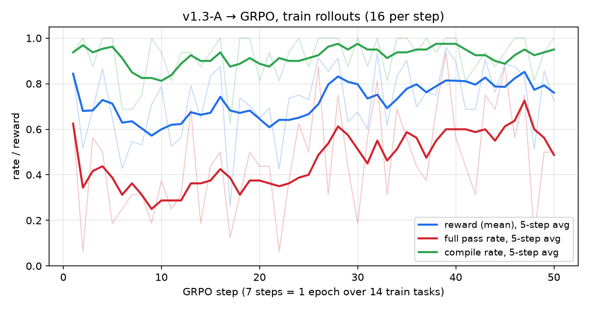

# v1.3 RL - GRPO Spike

September 30, 2026

**Goal:** check that RL on test-graded Jac tasks gives a learning signal and moves the v1.3 SFT model.

---

## 0. Preflight

Before building RL, check there is something to learn: run v1.3 SFT on Nitin's function test
suite (972 problems) two ways: once with greedy decoding, and 8 random samples per problem at
temperature 1.0. Rows split the problems by the greedy result.

| problems | count | greedy pass | pass@1 (1 random sample) | pass@8 (≥1 of 8 passes) | 1–7 of 8 pass | 0 of 8 pass |
|---|---:|---:|---:|---:|---:|---:|
| all | 972 | 57.9% (563) | 46.2% (3,596 / 7,776 samples) | 69.8% (678) | 504 | 294 |
| greedy passes | 563 | 100% (563) | 73.5% (3,309 / 4,504) | 97.7% (550) | 376 | 13 |
| greedy fails | 409 | 0% (0) | 8.8% (287 / 3,272) | 31.3% (128) | 128 | 281 |

- greedy pass = problems whose single greedy answer passes all hidden tests
- pass@1 = chance that one random sample passes = passing samples / all samples
- pass@8 = problems where at least one of the 8 samples passes
- 1–7 of 8 pass = problems with mixed results → the ones GRPO can learn from

**What it shows:**

- pass@8 is well above pass@1, so the model can often solve a problem but not reliably
- 504 / 972 problems are solved in some samples but not all → GRPO gets a signal there
- 294 problems are never solved in 8 tries → no signal, need easier tasks or a stronger base
- Preflight model: v1.3-B (the only model with an n=8 run). RL below starts from v1.3-A.

---

## 1. Dataset and Task

`dataset/rl/functions/spike-sample-20`: 20 hand-written single-function tasks, new (not from Nitin).

- Split: 14 train / 3 dev / 3 test
- Difficulty: train 9 easy + 5 medium, dev 2 + 1, test 2 + 1
- 5–7 hidden tests per task (109 total), inputs different from the examples the model sees
- Model sees `request.md` + `starter.jac`, answers with one ```` ```jac ```` block
- Reward = `jac check` fail → 0, else hidden tests passed / total

**Example: `binary_search` (easy)**

Model sees:

```md
# Binary search

Implement `binary_search(nums: list[int], target: int) -> int` on a list sorted in
ascending order. Return the index of the **first** occurrence of `target`, or `-1`
if it is absent.

Examples:
- `binary_search([1, 3, 5, 7], 5) == 2`
- `binary_search([1, 3, 5, 7], 4) == -1`
```

```jac
def binary_search(nums: list[int], target: int) -> int {
    return -1;
}
```

Hidden tests (model never sees them):

```jac
import from main { binary_search }

test "empty" { assert binary_search([], 3) == -1; }
test "first of duplicates" { assert binary_search([2, 4, 4, 4, 9], 4) == 1; }
test "first element" { assert binary_search([-5, 0, 5], -5) == 0; }
test "last element" { assert binary_search([-5, 0, 5], 5) == 2; }
test "above range" { assert binary_search([1, 2, 3], 10) == -1; }
test "long list" { assert binary_search([i * 2 for i in range(1000)], 1234) == 617; }
```

**Signal check:** v1.3-A SFT, 8 samples per train task → 12 / 14 tasks have mixed results
(some samples pass, some fail), reward varies on 14 / 14. Signal is not 0.

---

## 2. Training Setup

| | |
|---|---|
| Baseline | v1.3-A SFT (`output/adapter/0926-v13-A/sft`), Ornith 1.5 9B, 4-bit, LoRA r64 |
| Method | GRPO (TRL + Unsloth), continue training the SFT LoRA |
| Group | 8 samples per task, 2 tasks per step |
| Sampling | temperature 0.8, max 512 new tokens, thinking off |
| Optimizer | lr 5e-6, adamw 8-bit, no KL (beta 0) |
| Length | 50 steps ≈ 7 epochs over the 14 train tasks |
| Time | 4 h 32 m on RTX 5080, ~98% of it is generation |
| Grader | `jac check` + `jac test`, 20 s timeout, 3 GB memory cap |

Recipe: `script/train/recipe/0930-grpo-functions-spike/grpo.yaml`

---

## 3. Results

8 samples per task, temperature 0.8. Test split not evaluated yet.

**Train split** (14 tasks)

| | pass@1 | pass@8 | compile rate | test case pass rate | easy pass rate | medium pass rate |
|---|---:|---:|---:|---:|---:|---:|
| v1.3 SFT (baseline) | 37.5% | 85.7% | 90.2% | 67.4% | 41.7% | 30.0% |
| v1.3 + GRPO | **50.9%** | **92.9%** | **96.4%** | **77.4%** | **62.5%** | 30.0% |

**Dev split** (3 tasks, not trained on)

| | pass@1 | pass@8 | compile rate | test case pass rate | easy pass rate | medium pass rate |
|---|---:|---:|---:|---:|---:|---:|
| v1.3 SFT (baseline) | 25.0% | 66.7% | 83.3% | 51.7% | 18.8% | 37.5% |
| v1.3 + GRPO | **45.8%** | **100%** | 83.3% | **60.8%** | **37.5%** | **62.5%** |

- test case pass rate = hidden tests passed / total, counts partial passes
- easy / medium pass rate = samples that pass all hidden tests



- Reward and pass rate go up during training, compile rate stays ~0.9+
- Biggest gains on train: `binary_search` 1 → 8 / 8, `word_frequency` 4 → 7, `balanced_brackets` 0 → 3
- Medium does not move: `eval_rpn` +2, `merge_intervals` +1, `dotted_keys` −3

---

## 4. Insight and Next Steps

**Insight**

- The loop works: reward signal is real, grading is stable (0 grader errors, host RAM ≤ 17 GB)
- GRPO improves easy tasks, not medium ones yet
- Dev looks better too, but 3 tasks (24 samples) is too small to trust
- Easy tasks start to saturate after ~38 steps (10–15% groups all correct → no signal)
- No reward hacking found in rollouts; one watch item: GRPO sometimes answers
  `int_to_roman` with a long lookup table

**Next steps**

- **More tasks:** a dataset producer (`script/dataset/rl/`), more medium and harder tasks,
  dev / test with tens of tasks, dedup against Nitin
- **Evaluate test split** once for baseline and GRPO
- **Faster generation:** install Ornith linear-attention kernels, then try vLLM → longer runs
- **GSPO vs GRPO** at the same steps (GRPO checkpoint-25 is ready to compare)
- **New task types** from the RL plan: multifile, fullstack, tool use
